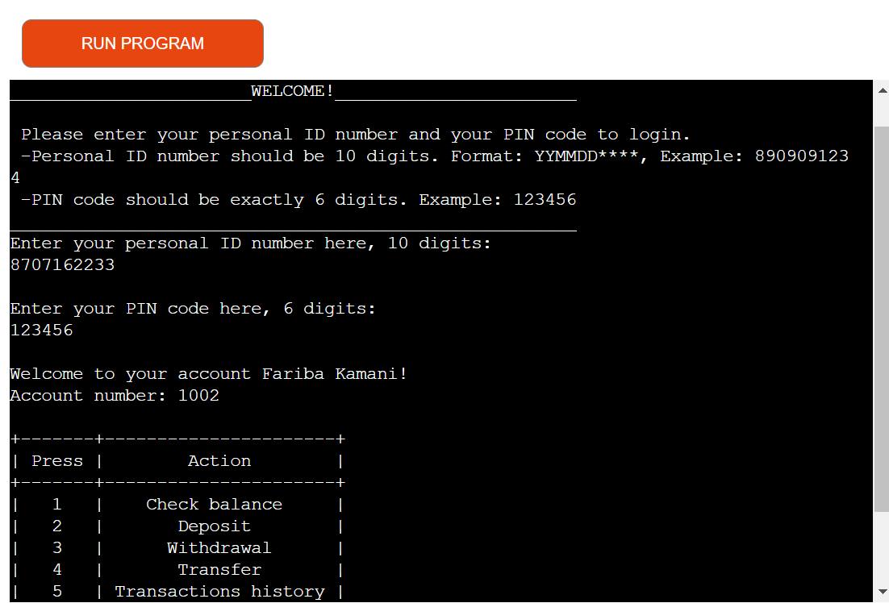
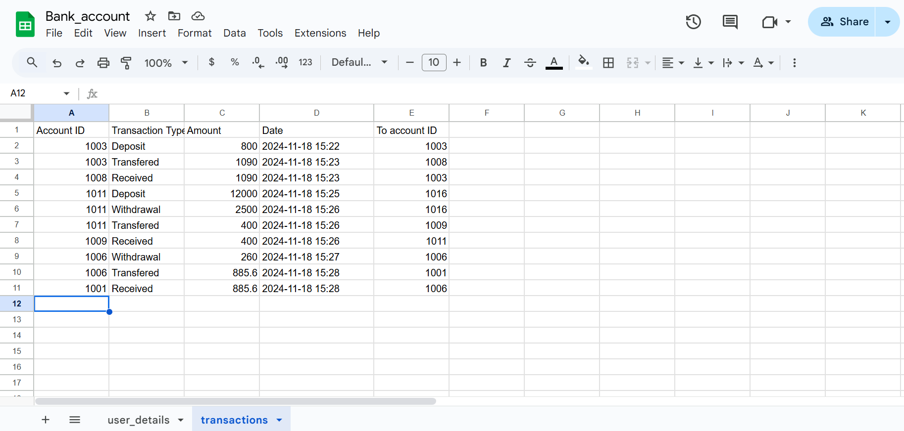
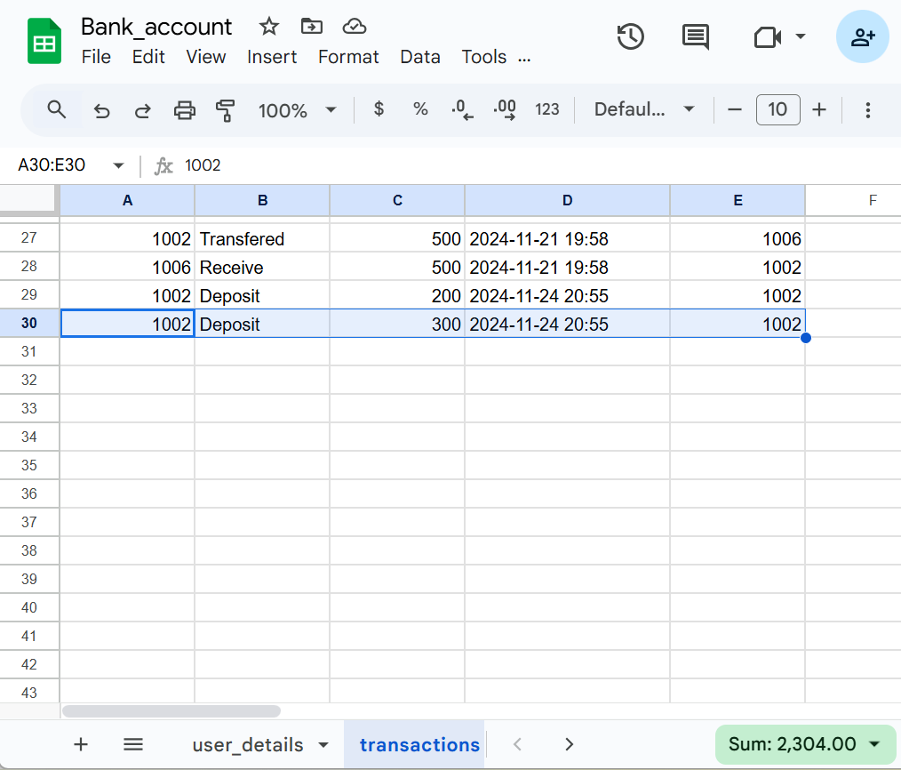
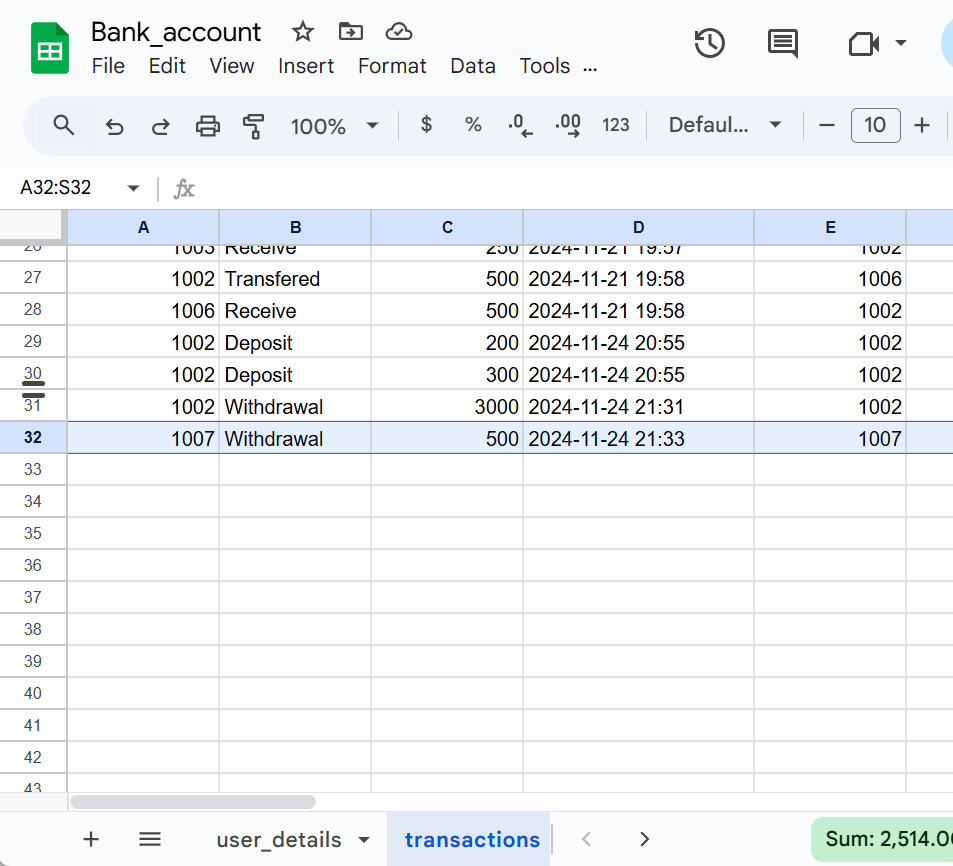
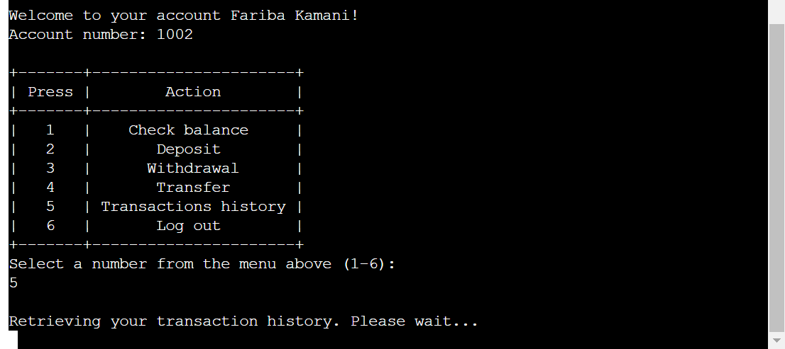
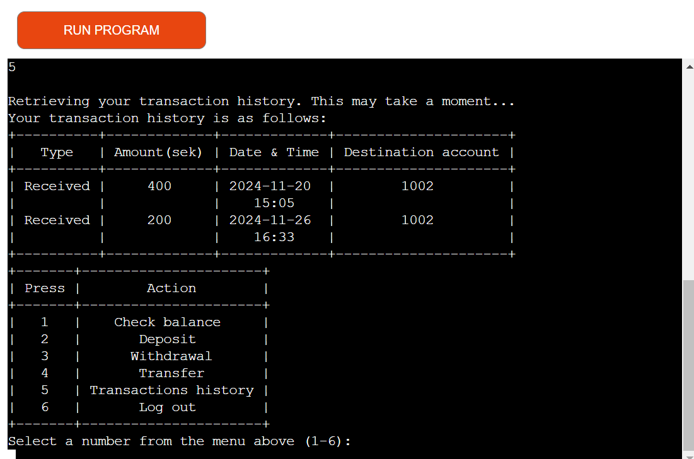

# Online Bank Account System

Visit the deployed site: [Online Bank Account System](https://online-bank-account-system-0e5e73e47365.herokuapp.com/)

## CONTENTS

* [Introduction](#introduction)
* [Project](#project)
    * [User goals](#user-goals)
    * [Site owner goals](#site-owner-goals)
    * [Pre development](#pre-development)
        * [Flowchart](#flowchart)
    * [Development](#development)
        * [Google sheets](#google-sheets)
        * [Technologies Used](#technologies-used)
            * [Languages Used](#languages-used)
            * [Libraries Used](#libraries-used)
        * [Features](#features)
        * [Future implementations](#future-implementations)
* [Deployment & Local Development](#deployment--local-development)
  * [Deployment](#deployment)
  * [Local Development](#local-development)
    * [How to Fork](#how-to-fork)
    * [How to Clone](#how-to-clone)
* [Testing](#testing)
  * [Solved Bugs](#solved-bugs)
  * [Known Bugs](#known-bugs)
* [Credits](#credits)
  * [Code Used](#code-used)
  * [Content](#content)
  * [Acknowledgments](#acknowledgments)

- - -

## Introduction

Online Bank Account System is a Python terminal portal, which runs in the Code Institute mock terminal on Heroku. The project is designed to simulate essential banking operations, such as checking balances, making deposits, withdrawals, transferring funds, and viewing transaction history. The system uses Google Sheets, connected via the Google Sheets API, to store and manage user data, ensuring all sensitive information is kept secure, private, and not exposed on GitHub.

The way the project works can be devided into four phases; user authentication, account Operations, account creation and data storage.

* The user authentication phase prompts the user to enter their Personal ID and PIN, and checks the Google Sheets database to validate credentials.

* During account operations, once the user is logged in, they can perform various banking tasks through a menu-driven interface, with all transactions updated in real-time in Google Sheets.

* During the account creation phase, new users can create an account with their personal information after the system validates their inputs (e.g., names and surnames must contain only letters and be at least two characters long.).

* Finally in data storage phase, user and transaction data are stored in a Google Sheet, ensuring persistent and organized data management.

## Project

### User goals

* To have secure, fast, and reliable login process
* To have access to their accounts 24/7
* To have access to smooth navigation, clear instructions and feedbacks while using their online bank account
* To be able to view balance, transaction history and perform transactions (deposit, withdraw and transfer)
* Ensure sensitive information (personal ID, PIN, account details) is protected.
* Instant confirmation of transactions or other actions done.

### Site owner goals

* To reduce the workload by automating tasks and actions that do not require personnel involvement.
* To keep their customers more satisfied by speeding up tasks and procedures that can be performed independently and without the involvement of personnel. 
* To handle issues if the user enters unauthorized inputs or attempts to perform unauthorized transactions.
* To ensure the platform is secure and reliable by protecting clients' sensitive information.

### Pre development

During the pre-development phase, based on the analysis I made of the user goals and the site owner's goals, I planned the system structure and decided how user data would be stored and managed (using Google Sheets as a database). I also planned which features should be included and what technologies should be utilized during the development, based on the portal's needs.

To describe the pre-development phase of this project, I have included the following flowchart to illustrate the planning and decision-making processes.

#### Flowchart
   
  

### Development

I have used Object-Oriented Programming (OOP) principles in Python for implementing this project. This helps making the system easy to maintain and extend. The OOP design consists of the BankAccount class which serves as the blueprint for all user accounts, and NewAccount class which inherits from BankAccount and handles the creation of the new accounts. 

I have decided not to include error pages such as 404 (Not Found) and 500 (Internal Server Error) in my project since my application is terminal-based and such error pages are more relevant for web-based applications. Instead I have tried to improve the user experience in the terminal with clear error messages for issues such as invalid inputs or unmatched cell in the worksheets during the development of the project.

#### Google sheets

The project is connected to Google Sheets API for real-time data storage and data updates. The Sheets serve as the system's backend. 

* All user account details are stored in the user-details worksheet.

* Each row in the user-details worksheet represents an account.

* The system retrieves user data during login and updates balances and transaction history after any action (e.g., withdrawal, deposit).

* Transaction data is stored in a separate worksheet (transactions) for detailed transaction history.

  

  

#### Technologies Used

* [Git](https://git-scm.com/) - For version control.

* [Github](https://github.com/) - To save and store the files for the website.

* [GitPod](https://gitpod.io/) - IDE used to create the site.

* [Heroku](https://heroku.com/) - a cloud platform-as-a-service (PaaS) that allows building, deploying, and managing applications without needing to manage infrastructure.

* [Microsoft Bing Copilot Tools](https://www.bing.com/chat) - An AI chat that I used to check the spell and grammar of my website and README.md file.

* [Google Cloud Platform](https://console.cloud.google.com/) - A platform for activating the API credentials

* [Google Sheets](https://docs.google.com/spreadsheets/) - To store and manage user data, data retrieval and updates.

* [Code Institute CI Python Linter](https://pep8ci.herokuapp.com/) - to validate the Python code.

* [Lucidchart](https://www.lucidchart.com/) - To create flowchart.

* Microsoft Photos - To edit the images used in the README.md file.

##### Languages Used

Python

##### Libraries Used

* gspread: I have used this library to interact with Google Sheets from the Python application which allows retrieving, updating, and appending data in Google Sheets.

* google.oauth2.service_account.Credentials: It handles authentication to connect the Python app with the Google Sheets API securely. I have used this library to authenticate and authorize my app to read and write data in Google Sheets.

* datetime: This library which provides functions for handling date and time has been used to log transaction date and time in the Google Sheets for historical records.

* tabulate: I used this library to format and display tabular data as text tables. I chose to display the actions menu and the transaction history in a table format for better readability in the terminal.

#### Features

* **User authentication:**

  * **Personal ID and PIN code login:** Allows users to log in securely with their personal ID and PIN code.

    

    

  * **Login input error handling:** Validates the user login inputs to ensure they only include digits and are of a certain length.

    

    

  * **Credential validation:**

    * Confirms whether the user has an account or not. 

      * If the account doesn't exist, the user is informed and offered to create a new account.(See the image under [New Account Creation](#account-creation))

      * If the account is found: 

        * Verifies the input PIN code against the stored PIN code in Google Sheets for the account matched with the inputted personal ID.

          * If the PIN code doesn't match, the user is informed and asked to enter the correct PIN code.

            

          * If the PIN code matches, the user successfully logs in. (See the image under [Account Dashboard](#account-dashboard))

* **New Account Creation:** This option is offered if the user's personal ID doesn't exist in Google Sheets. 

  

  * Enables new users to create an account with personal details and a unique account number and stores the new account information in Google Sheets.

    * User name and surname input

    * Account creation confirmation and new account details

      

    * Error handling: Provides feedback for invalid inputs and prompts users to enter correct inputs.

      

      

      

    * If the user chooses not to create a new account, the user will be logged out.

      

* **Account Dashboard:** Displays a personal welcome message, including the account holder's name and account number, along with an interactive menu for account actions when the user successfully logs in.

  * The menu input error handling

    

* **The Bank Operations:**

  * **Check Balance:** Runs by choosing 1 from the menu and allows users to view their current account balance. 

      
  
  * **Deposit Funds:** Runs by choosing 2 from the menu,

    * Enables users to deposit money into their accounts.

    * Successful deposit confirmation message with information about the current balance

      

    * Error handling if a user tries to deposit an amount less than or equal to zero, or deposit more than 5000 SEK.

       

    * Updates the account balance and logs the transaction details in Google Sheets.

      

  * **Withdraw Funds:** Runs by choosing 3 from the menu,

    * Allows users to withdraw money from their accounts if sufficient balance is available.

    * Successful withdrawal confirmation message with information about the current balance

      

    * Updates the balance and logs the transaction in Google Sheets.

      

    * Error handling if a user tries to withdraw an amount less than or equal to zero, or withdraw more than the current available balance.

      

  * **Fund Transfer:** Runs by choosing 4 from the menu,

    * Enables users to transfer money to another account.

    * Successful transfer confirmation message with information about the current balance

      

    * Validates the recipient account

      

      

        * In the case that the inputted account doesn't exist, the user is given the option to either try again or go back to the main menu.

    * Logs the transfer in both accounts' transaction histories.

      

    * Error handling if a user tries to transfer an amount less than or equal to zero, or if the user tries to transfer more than the current available balance.

      

* **Transaction History:** Runs by choosing 5 from the menu,

  * Displays a message informing the user that their transactions are being retrieved, provided that transactions are recorded for the user.

    

  * Displays a detailed history of all transactions (deposits, withdrawals, transfers).
  
  * Uses the tabulate library to format the history into a readable table.

    

  * If there are no recorded transactions

    

* **Accessible menu after all operations:** The menu becomes available after each operation is done successfully, allowing the user to perform different operations during their login time.

* **Data Storage:** Utilizes Google Sheets as a cloud-based storage for user details and transaction records.

* **Log Out:** Runs by choosing 6 from the menu,

  * Logs the user out of the system securely, with an ending message.

        

#### Future implementations

 * Add multi-currency support.
 * Implement email or SMS notifications for transactions.
 
- - -
## Deployment & Local Development

### Deployment

This project was deployed using Code Institute's mock terminal for Heroku. The Application has been deployed from GitHub to Heroku by following the steps below:

1. Log in to your account at heroku.com
2. Create a new app, add a unique app name (for example online-bank-account-system) and then choose your region
3. Click on create app
4. Go to "Settings"
5. Under Config Vars add the private API key information using key 'CREDS' and into the value area copy the API key information added to the .json file.  Also add a key 'PORT' and value '8000'.
6. Add required buildpacks (further dependencies). For this project, set it up so Python will be on top and Node.js at the bottom
7. Go to "Deploy" and select "GitHub" in "Deployment method"
8. To connect Heroku app to your Github repository code enter your repository name, click 'Search' and then 'Connect' when it shows below.
9. Choose the branch you want to build your app from
10. If preferred, click on "Enable Automatic Deploys", which keeps the app up to date with new changes pushed to your GitHub repository
11. Wait for the app to build. Once ready you will see the “App was successfully deployed” message and a 'View' button to take you to your deployed link.

### Local Development

#### How to Fork

To fork the repository:

1. Log in (or sign up) to Github.
2. Go to the repository for this project, [Fariba-Kamani/online-bank-account-system](https://github.com/Fariba-Kamani/online-bank-account-system). 
3. Click the Fork button in the top right corner.

#### How to Clone

To clone the repository:

1. Log in (or sign up) to GitHub.
2. Go to the repository for this project, [Fariba-Kamani/online-bank-account-system](https://github.com/Fariba-Kamani/online-bank-account-system).
3. Click on the code button, select whether you would like to clone with HTTPS, SSH or GitHub CLI and copy the link shown.
4. Open the terminal in your code editor and change the current working directory to the location you want to use for the cloned directory.
5. Type 'git clone' into the terminal and then paste the link you copied in step 3. Press enter.

- - -

## Testing

Please refer to [TESTING.md](TESTING.md) file for all testing carried out.

### Solved Bugs

* One of the issues I encountered during the development of the project was with the name input validation for creating a new account. Despite showing a validation error message, the original code was still allowing non-alphabetic characters to pass. The issue in the original code was that despite showing a validation error message for incorrect inputs, the loop would continue due to `condition = True` being set after the except block. This means that even after encountering invalid inputs, the loop would restart immediately without allowing for proper input correction. I resolved this problem by simplifying the loop using `while True`, which ensures that the loop continues until the `break` statement is reached. I added better input validation checks directly within the loop and used `continue` statements to allow for immediate re-prompting of inputs if errors are found, without prematurely breaking the loop. This way, the user's name and surname will only be updated, and the loop will be broken, once all validation checks are passed.

* Another issue was that the `transactions_history` method was printing the same transaction twice. The bug was caused by the initial implementation, which did not account for the column in which the account number was found. As a result, it was finding two matches for the account number in the "transactions" worksheet columns, leading to duplicate entries being appended to the transaction history list. I fixed this problem by filtering `matched_cells` to include only those cells where the account number is found specifically in the first column `(col == 1)`. This ensures that each transaction is counted only once.

* The initial implementation of the `transfer` method was causing an issue by not handling the situation where the account number entered by the user did not exist in the worksheet. This led the program to try to access `.row` on a `None` object. In the fixed code, I use a loop and additional checks to ensure that the user input is handled properly. The transfer operation only proceeds if a valid account is found, ensuring that `matched_cell` is never `None` when attempting to access `.row`.

* Another noteworthy bug occurred due to the initial implementation of the `transfer` method not separating validation handling from the actual transfer logic. This led to the reappearance of transfer input questions after completing a transfer or the reappearance of the menu after logging out. The validation and transfer operations were intermingled, causing the method to loop incorrectly and present options or prompts multiple times. The `transfer` method combined both the validation of the account number and the execution of the transfer in a single method. This led to confusion in the control flow, where the same prompts could reappear after the transfer was completed or after the user logged out. The solution involved separating the validation handling into a distinct method called `transfer_validation()`.

### Known Bugs

  There are no known or unsolved bugs left in the program.

- - -

## Credits

### Code Used

Throughout the entire project development, I utilized the Code Institute course materials for Python. I followed the tutorials for the Love Sandwiches walkthrough project to wire up APIs, confirm access to Google Sheets, and start my project. I also used Code Institute's mock terminal for Heroku for deployment. The links from Code Institute and external resources that I relied on throughout my project are as follows:

* [Activating our API credentials](https://learn.codeinstitute.net/courses/course-v1:CodeInstitute+LS101+1/courseware/293ee9d8ff3542d3b877137ed81b9a5b/071036790a5642f9a6f004f9888b6a45/?child=last) - For activating the projects API credentials.
* [Getting Our Workspace Set Up](https://learn.codeinstitute.net/courses/course-v1:CodeInstitute+LS101+1/courseware/293ee9d8ff3542d3b877137ed81b9a5b/071036790a5642f9a6f004f9888b6a45/?child=last) - For adding the credentials file `creds.json` to the project and connect my Google Sheets and .gitignore my `creds.json`. 
* [Connecting to our API with Python](https://learn.codeinstitute.net/courses/course-v1:CodeInstitute+LS101+1/courseware/293ee9d8ff3542d3b877137ed81b9a5b/071036790a5642f9a6f004f9888b6a45/?child=last) - For importing gspread and google.oauth2.service_account, add SCOPE and Authentication setup.
* [Code Institute/Python Essentials/Classes and Object Oriented Concepts]() - For learning about using classes and OOP in my project.
* [Built-in Functions & Tools/datetime](https://learn.codeinstitute.net/courses/course-v1:CodeInstitute+CPP_06_20+3/courseware/272f493b4d57445fbd634e7ceca3a98c/4ab3e01af44f4bf2828739c1d0591a45/) - For importing and using datetime to record transactions with proper timestamps.
* [Validating our data part1 & part 2](https://learn.codeinstitute.net/courses/course-v1:CodeInstitute+LS101+1/courseware/293ee9d8ff3542d3b877137ed81b9a5b/c92755338ef548f28cc31a7c3d5bfb46/?child=last) & [Creating our user request loop](https://learn.codeinstitute.net/courses/course-v1:CodeInstitute+LS101+1/courseware/293ee9d8ff3542d3b877137ed81b9a5b/c92755338ef548f28cc31a7c3d5bfb46/?child=last) - For developing input error handling that repeatedly prompts the user to enter valid input until the input is validated.
* [Python-tabulate](https://github.com/astanin/python-tabulate) - For learning about tabulate library and using it in my project for displaying the menu and the user's transaction history.
* Love Sandwiches & [gspread](https://github.com/burnash/gspread) - For learning how to get cell values, all values from a row or a column, find a specific cell, and use other gspread library functions. These tools have been instrumental in my project for retrieving data from and updating my Google Sheets.

### Content

For documentation and creating my README.md file I have taken inspiration from the sample README.md file that my mentor shared with me [corri-construction-p3](https://github.com/todiane/corri-construction-p3/blob/main/README.md).

All other technologies used during the development of this project are mentioned and credited in the [technologies used](#technologies-used) section.

### Acknowledgments

I would like to acknowledge

* My Code Institute mentor, Jubril Akolade, for inspiring me to choose this project as well as reviewing my project. His meticulous reviews have significantly enhanced its quality. Jubril's insistence on validating each user's input individually, rather than re-prompting for all inputs upon a single validation error, has pushed me to refine and improve my project, ensuring a smoother user experience.
* The Code Institute tutor team, who were available and guided me whenever I was stuck troubleshooting issues during the development of my projects.
* My partner and friends, who took the time to test my website on their devices and provided constructive feedback.