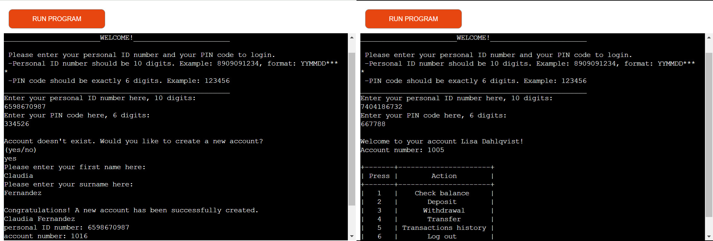

# Online Bank Account System -  Testing

Visit the deployed site: [Online Bank Account System](https://online-bank-account-system-0e5e73e47365.herokuapp.com/)

- - -

## CONTENTS

* [AUTOMATED TESTING](#automated-testing)
  * [PEP8 Validator](#pep8-validator)
* [MANUAL TESTING](#manual-testing)
  * [Testing User Goals](#testing-user-goals)
  * [Testing Site Owner Goals](#testing-site-owner-goals)
  * [Testing Google Sheets](#testing-google-sheets)
  * [The Full Testing](#the-full-testing)
    

Testing was ongoing throughout the entire project development, and all detected issues have been dealt with and resolved during this time. The deployed site was tested on the following browsers on a VivoBook Asus laptop: Chrome (version: 129.0.6668.100 (Official Build) (64-bit)), Microsoft Edge (version: 129.0.2792.89 (Official Build) (64-bit)), Opera One (version: 114.0.5282.102), and Firefox (version: 131.0.3 (64-bit)). The website proved to be compatible with all the tested browsers. Furthermore, a few friends conducted additional testing on their laptops, and no issues were detected or reported in these sessions.

### Automated Testing

#### PEP8 Validatior

### Manual Testing

#### Testing User Goals

* **To have secure, fast, and reliable login process**
  * Testing Steps:
    * Attempted login with valid credentials.
    * Attempted login with incorrect credentials.
    * Simulated multiple failed login attempts to make sure the account doesn't allow login as long as the login credentials are incorrect.
    * Measured the response time for logging in.
  * Expected Outcomes:
    * User is granted access only with correct credentials.
    * Error messages are clear and specific (e.g., "Incorrect PIN or invalid ID").
    * Response time for login is under 2 seconds.
    * No data is exposed during login.
  * Result: As expected.

* **To have access to their accounts 24/7**
  * Testing Steps:
    * Attempted to access the system at various times of the day.
    * Tested access from different laptops and networks.
  * Expected Outcomes:
    * System remains accessible at all times.
    * System is accessible by all tested laptops and networks.
  * Result: as expected.

* **To have access to smooth navigation, clear instructions and feedbacks while using their online bank account**
  * Testing Steps:
    * Tested each menu option for clarity and functionality.
    * Performed invalid actions (e.g., inputting invalid data) and observe feedback messages.
    * Navigated back and forth between the main menu, minor menus and different operations to ensure no dead ends or confusing loops happening.
  * Expected Outcomes:
    * Navigation is intuitive and follows user expectations.
    * Clear and concise feedback messages for every action.
    * No bugs or crashes while navigating.
  * Result: As expected.

* **To be able to view balance, transactions history and perform transactions (deposit, withdraw and transfer)**
  * Testing Steps:
    * Checked account balance for accuracy after deposits, withdrawals, and transfers.
    * Viewed transaction history to ensure all actions are logged with accurate timestamps and details.
    * Tested transactions with edge cases, such as withdrawing more than the available balance or transferring to an invalid account.
  * Expected Outcomes:
    * Balance updates immediately after transactions.
    * Transaction history logs are accurate and complete.
    * Invalid actions are prevented with proper error messages.
  * Result: As expected.

* **Ensure sensitive information (personal ID, PIN, account details) is protected.**
  * Testing Steps:
    * Inspected the code to confirm that sensitive information (e.g., PIN, personal ID) is not stored in plain text.
    * Simulate unauthorized access attempts.
    * Tested for user information exposure
  * Expected Outcomes:
    * Sensitive information is encrypted or secured properly.
    * Unauthorized access attempts are blocked, and proper logging is implemented.
    * User information, including the personal ID number and PIN code, is logged to the terminal only during the creation of a new account: once when giving the user the option to create a new account, and once when the account creation has been successfully completed. This allows the user to review the accuracy of their recorded personal details and remember the PIN code needed for future logins.
    * creds.json is .gitignored in the project to prevent private or sensitive information from being exposed on github.
  * Result: As expected, with the exception being during the creation of a new account for a justified reason. 

* **Instant confirmation of transactions or other actions done.**

#### Testing Site Owner Goals

* To reduce the workload by automating tasks and actions that do not require personal involvement.
* To keep their customers more satisfied by speeding up tasks and procedures that can be performed independently and without the involvement of personnel. 
* To handle issues if the user enters unauthorized inputs or attempts to perform unauthorized transactions.
* To ensure the platform is secure and reliable by protecting clients' sensitive information.

#### Testing Google Sheets

#### The Full Testing

* **User authentication:**
 
 | Feature | Expected Outcome | Testing Performed | Result | Pass/Fail |
| --- | --- | --- | --- | --- |
| Personal ID input | The Personal ID input field appears for the user to input their personal ID number | Ran the program | The Personal ID input field appeared and took the required input | Pass|
| PIN code input | The PIN code input field appears and takes the user's input | Tested during the program run | The PIN code input field appeared and took the required input | Pass |
| Personal ID input error handling | An error message appears and prompts the user to enter a valid input | Tested by entering an empty field, input with both fewer and more characters than 10, including letters and signs | The related error message appeared and prompted the user to enter a valid input | Pass |
| PIN code input error handling | An error message appears and prompts the user to enter a valid input | Tested by entering an empty field, input with both fewer and more characters than 6, including letters and signs | The related error message appeared and prompted the user to enter a valid input | Pass |
| Credential validation if the user has an account but the PIN code is incorrect | An error message appears if the PIN code doesn't match the one stored in the Google Sheets and prompts the user to enter the correct PIN code | Entered personal ID number belonging to an existing account with a wrong PIN code | An error message appeared prompting the user to enter the correct PIN code  | Pass |
| Credential validation if the user has an account and the PIN code is correct | The user successfully logs in | Entered personal ID number belonging to an existing account with the correct PIN code | The user successfully logged in and the account dashboard appeared | Pass |
| Credential validation if the account doesn't exist | Offers the user the option to create a new account | Entered a personal ID number that doesn't exist in the Google Sheets | It informed the user that the account didn't exist and offered to create a new account | Pass |

* **New account creation:**

| Feature | Expected Outcome | Testing Performed | Result | Pass/Fail |
| --- | --- | --- | --- | --- |
| New account creation input handling if the user enters "yes" | Asks for the user's name and surname | Inputted "yes" | Resulted as expected | Pass |
| New account creation input handling if the user enters "no" | logs out with an ending message | Inputted "no" | Resulted as expected | Pass |
| New account creation input error handling for invalid inputs | logs an error message and prompts the user for valid input | Inputted invalid data | Resulted as expected | Pass |
| New user's name input field | Appears and takes input | Answered "yes" to "Create new account" question  | Resulted as expected | Pass |
| New user's surname input field | Appears and takes input | Entered a valid name | Resulted as expected | Pass |
| name and surname input error handling | Provides feedback for invalid inputs (empty, less than two characters long, including characters other than alphabetical signs) and prompts users to correct their inputs | Entered all different types of invalid data | resulted as expected | Pass |
| Account creation confirmation and new account details | Appears after user enters valid name and surname | Entered valid inputs | resulted as expected | Pass |
| Stores the new account information in Google Sheets | Checked the "user-details" worksheet after the new account creation was successfully done | New account information should be available in a new row with a unique account number | resulted as expected | Pass |

* **Account dashboard:**

| Feature | Expected Outcome | Testing Performed | Result | Pass/Fail |
| --- | --- | --- | --- | --- |
| Account dashboard when the user successfully logs in | Displays a personal welcome message, including the account holder's name and account number, along with an interactive menu for account actions | Logged in with an existing account personal ID and PIN code | Resulted as expected | Pass |
| The menu input | Shows the account's current balance | Entered "1" | Resulted as expected | Pass |
| The menu input | Allows deposit operation | Entered "2" | Resulted as expected | Pass |
| The menu input | Allows withdrawal operation | Entered "3" | Resulted as expected | Pass |
| The menu input | Allows transfer operation | Entered "4" | Resulted as expected | Pass |
| The menu input | Shows the accounts transaction history if available, or the message "No transactions found ..." if there are no records of transactions in the Google Sheets | Entered "5" | Resulted as expected | Pass |
| The menu input | Logs out with an ending message | Entered "6" | Resulted as expected | Pass |
| The menu input error handling | Shows an error message and prompts the user to enter valid input | Entered invalid data | Resulted as expected | Pass |
| The menu | Appears after each operation done successfully | Performed all operations (check balance, deposit, withdrawal, transfer, transaction history, and log out) | The menu appears after all operations done successfully | Pass |

* **The banking operations:**

| Feature | Expected Outcome | Testing Performed | Result | Pass/Fail |
| --- | --- | --- | --- | --- |
| **Check balance** | Shows the account's current balance saved in the Google Sheets and goes back the menu | Chose "1" from the menu | Resulted as expected | Pass |
| **Deposit funds** | Asks for the amount the user wants to deposit to their account | Chose "2" from the menu | Resulted as expected | Pass |
| Deposit funds input error handling | Shows the related error message and prompts the user to enter a valid amount | Entered invalid amounts (amounts less than or equal to zero, or more than 5000) | Resulted as expected | Pass |
| Successful deposit confirmation message with information about the current balance | logs on the terminal if deposit has been successful, and goes back to the menu | Entered an amount more than zero and less than or equal to 5000 | Resulted as expected | Pass |
| Tracks deposits by updating the account balance and logging transactions | After a successful deposit, the system increases the balance in the "user-details" worksheet and appends a new record in the "transactions" worksheet | Checked the related worksheets for updates after successful deposit | Resulted as expected | Pass |
| **Withdrawal funds** | Asks the user to input the amount the user wants to withdraw from their account| Chose "3" from the menu | Resulted as expected | Pass |
| Withdrawal funds input error handling | Shows the related error message and prompts the user to enter a valid amount | Entered invalid amounts (amounts less than or equal to zero, or more than the account's current balance) | Resulted as expected | Pass |
| Successful withdrawal confirmation message with information about the current balance | Logs the message on the terminal if the withdrawal has been successful, and then goes back to the menu. | Entered an amount more than zero and less than or equal to the accounts current balance | Resulted as expected | Pass |
| Tracks withdrawals by updating the account balance and logging transactions | After a successful withdrawal, the system reduces the balance in the "user-details" worksheet and appends a new record in the "transactions" worksheet | Checked the related worksheets for updates after successful withdrawal | Resulted as expected | Pass |
| **Fund Transfer** | Asks the user to input the account number the user wants to transfer money to | Chose "3" from the menu | Resulted as expected | Pass |
|Recipient account validation | Gives the user the option to try again (press "1") or go back to menu if the recipient account doesn't exist (press "2") | Entered an account number that doesn't exist in Google Sheets | Resulted as expected | Pass |
| Navigation input handling | Asks the user to input the account number the user wants to transfer money to | Entered "1" as the input| Resulted as expected | Pass |
| Navigation input handling | Goes back to menu | Entered "2" as the input | Resulted as expected | Pass |
| Navigation input error handling | Shows an error message and prompts the user to either enter "1" or "2" | Entered anything except for "1" and "2," including other digits, alphabets, and signs, as well as left the input field empty | Resulted as expected | Pass |
| Recipient account validation | Shows an error message indicating that the user can't transfer to their own bank account, and prompts the user to enter a different account number | Entered the account owner's account number | Resulted as expected | Pass |
| Recipient account validation | Asks the user to input the amount the user wants to transfer if the recipient account is found | Entered an account number that exists in the Google Sheets but is not the account owner's account number | Resulted as expected | Pass |
| Transfer amount input validation if a user tries to transfer an amount less than or equal to zero, or if the user tries to transfer more than their current available balance | Shows an error message and prompts the user to enter a valid amount | Entered amounts less than or equal to zero and greater than the user's balance | Resulted as expected | Pass |
| Successful transfer confirmation message with information about the user's current balance | Logs the message on the terminal if the transfer has been successful, and then goes back to the menu | Entered an existing recipient account and a valid amount to transfer | Resulted as expected | Pass |
| Tracks transfers by updating both account balances and logging transactions| After a successful transfer, the system reduces the user's balance and increases the recipient's balance in the "user-details" worksheet and appends the new records in both accounts' transaction histories | Checked the related worksheets for updates after successful transfer | Resulted as expected | Pass |
| **Transaction History** if the account's transactions are available in the "transactions" worksheet | Displays a detailed history of all transactions recorded in the "transactions" worksheet, in form of a readable table | Logged into an account with available transactions and chose option "5" from the menu | Resulted as expected | Pass |
| Transaction History if the account's transactions aren't available in the "transactions" worksheet | Displays the message "No transactions found for this account" and goes back to the menu | Logged into an account without any recorded transactions and chose option "5" from the menu | Resulted as expected | Pass |
| **Log out** | Logs the user out of the account, with an ending message | Chose option "6" from the menu | Resulted as expected | Pass |

